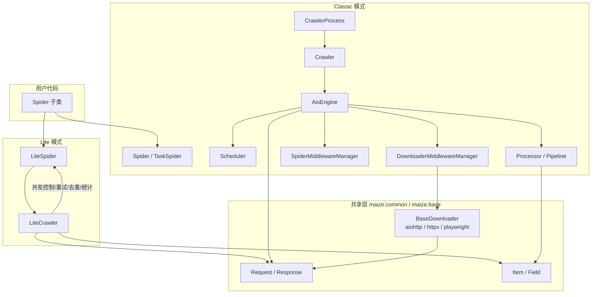
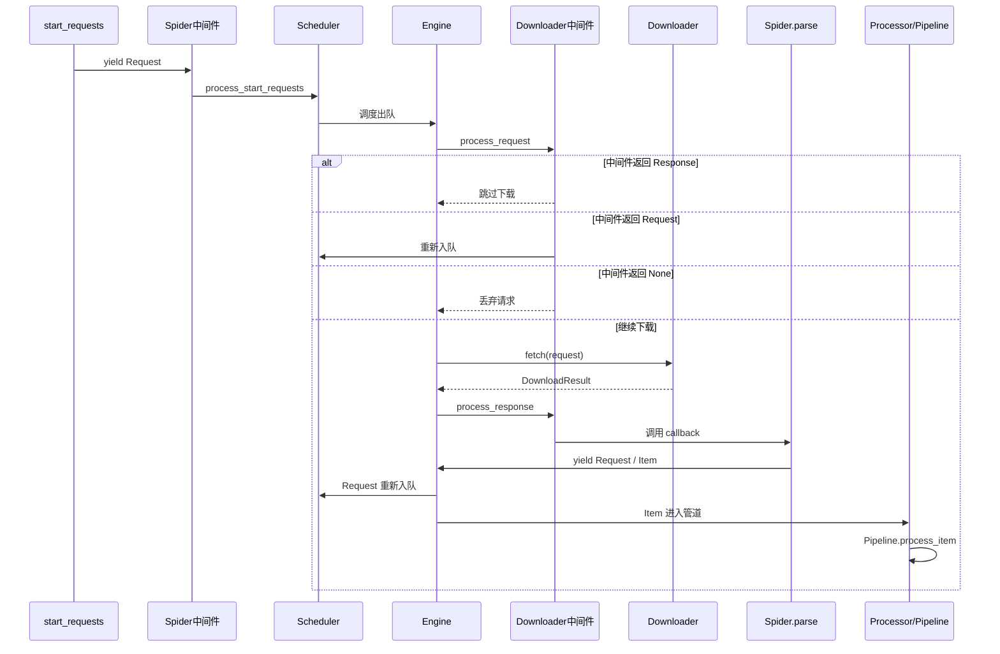
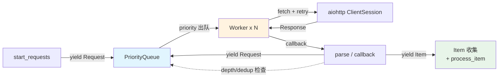
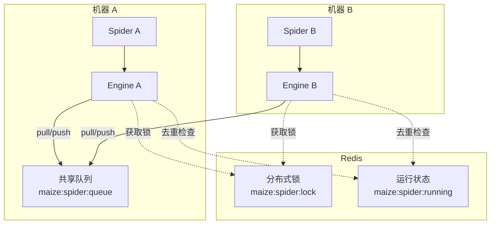

# 架构概览

理解 maize 的组件结构和数据流，是高效使用框架的基础。

## 双模式架构

maize 提供 Lite 和 Classic 两种模式，共享 `maize.common` 和 `maize.base` 底层模块。



## Classic 模式请求生命周期

Classic 模式是完整的中间件链架构，一个请求从生成到处理完毕会经过以下阶段：



### 各阶段职责

| 阶段 | 组件 | 职责 |
|------|------|------|
| **请求生成** | `start_requests` / `parse` | Spider 产出 `Request` 或 `Item` |
| **Spider 中间件** | `SpiderMiddlewareManager` | 处理 `start_requests` 输出、爬虫回调输入输出 |
| **调度** | `Scheduler` | 请求队列管理、优先级排序、分布式去重 |
| **下载器中间件（请求）** | `DownloaderMiddlewareManager.process_request` | 修改请求、短路返回响应、丢弃请求 |
| **下载** | `BaseDownloader` 子类 | 执行 HTTP 请求，返回 `Response` |
| **下载器中间件（响应）** | `DownloaderMiddlewareManager.process_response` | 修改响应、触发重试、丢弃响应 |
| **解析** | `Spider.parse` / `callback` | 从 `Response` 提取数据，产出 `Item` 或新 `Request` |
| **数据处理** | `Processor` → `Pipeline` | 批量处理 Item，入库或落盘 |

## Lite 模式请求生命周期

Lite 模式简化了架构，去掉了中间件链和调度器，由 `LiteCrawler` 直接管理队列和 Worker：



### Lite vs Classic 关键差异

| 环节 | Lite | Classic |
|------|------|---------|
| 请求调度 | `asyncio.PriorityQueue`（进程内） | `Scheduler`（本地/Redis 分布式） |
| 请求去重 | 内置 `_seen` set + hash | 中间件（`DepthMiddleware` 等） |
| 中间件 | 不支持 | 三层中间件链 |
| 数据处理 | `process_item` 钩子 | `Pipeline` 链（批量、多管道） |
| 下载器 | aiohttp 固定 | aiohttp / httpx / playwright / patchright |
| 信号处理 | `LiteCrawler.crawl()` 内置 SIGINT/SIGTERM | `CrawlerProcess` 管理 |
| 统计 | `crawler.stats` dict | `StatsCollector` |

## 核心组件

### Request / Response

`maize.common.http.Request` 和 `Response` 是两种模式共享的 HTTP 抽象层。

- `Request` 封装 URL、method、headers、params、data、json、callback、priority、proxy、meta
- `Response` 提供 `xpath()`、`css()`、`json()`、`urljoin()`、`text`、`status` 等方法
- `Request.hash` 用于去重，包含 method+url+headers+params+data+json 六字段
- `Request.priority` 使用 min-heap，**数值越小越优先**
- `Request.meta` 用于在回调间传递数据，Lite 内部用 `_lite_` 前缀传递框架状态

详见 [Request 详解](features/request.md) 和 [Response 详解](features/response.md)。

### Item

`maize.common.items.Item` 基于 Pydantic v2，支持字典风格和属性风格访问。

- `__table_name__` 指定数据库表名（MySQL Pipeline 自动入库）
- `to_dict()` / `model_dump()` 序列化
- `Field` 支持所有 Pydantic 字段特性（`default`、`default_factory`、`ge`、`description`）

详见 [Item 数据项](features/item.md)。

### Downloader

四种内置下载器，均继承 `BaseDownloader`：

| 下载器 | 底层库 | 特点 |
|--------|--------|------|
| `AioHttpDownloader` | aiohttp | 默认，高性能，连接池管理 |
| `HTTPXDownloader` | httpx | HTTP/2 支持，不支持 session |
| `PlaywrightDownloader` | Playwright | JS 渲染，RPA 自动化 |
| `PatchrightDownloader` | Patchright | 反检测能力更强 |

详见 [下载器](features/downloader.md)。

### 中间件系统（Classic 专有）

三层中间件，按优先级数字排序（越小越先执行，`process_response` 等反向方法除外）：

```
下载器中间件: process_request → 下载 → process_response / process_exception
爬虫中间件:   process_start_requests → parse 输入 → parse 输出
管道中间件:   process_item → Pipeline → process_error_item
```

内置中间件：

| 中间件 | 层级 | 说明 |
|--------|------|------|
| `RetryMiddleware` | 下载器 | 请求失败自动重试 |
| `UserAgentMiddleware` | 下载器 | UA 轮换 |
| `DefaultHeadersMiddleware` | 下载器 | 默认请求头 |
| `DepthMiddleware` | 爬虫 | 深度控制 + 去重 |
| `HttpErrorMiddleware` | 爬虫 | HTTP 错误处理 |
| `ItemValidationMiddleware` | 管道 | Item 字段验证 |
| `CleanerMiddleware` | 管道 | 数据清洗 |

详见 [中间件系统](features/middleware.md)。

### Pipeline（Classic 专有）

数据管道链，`parse` 中 `yield Item` 后自动进入：

- **批量处理**：框架聚合多个 Item 后批量传入 `process_item`
- **多管道**：按配置顺序执行多个 Pipeline
- **错误重试**：`process_item` 返回 `False` 触发重试，超限进入 `process_error_item`
- **内置 Pipeline**：`EmptyPipeline`（默认空实现）、MySQL Pipeline（`maize[mysql]`）

详见 [Pipeline 管道](features/pipeline.md)。

### Scheduler（Classic 专有）

请求调度器，管理请求队列：

- 本地模式：进程内队列
- 分布式模式：基于 Redis 的共享队列（`is_distributed=True`）
- 分布式锁：`RedisUtil` 实现，防止多进程重复抓取

## 分布式架构

启用 `is_distributed=True` 后，多个爬虫进程通过 Redis 共享请求队列：



配置方式见 [配置说明 - Redis 配置](features/settings.md#redis-redissettings)。

## 配置系统

基于 Pydantic v2 的强类型配置，支持 8 种配置方式（优先级从高到低）：

1. `custom_settings`（代码内 dict）
2. `SpiderSettings` 对象（`run(settings=...)`）
3. 系统环境变量
4. `.env` 文件
5. YAML 配置文件
6. TOML 配置文件
7. `settings.py` 配置文件（`run(settings_path=...)`）
8. 默认配置

详见 [配置说明](features/settings.md)。

## 下一步

- [使用前必读](use/before_use.md) — 模式选择决策
- [快速上手](quick_start.md) — 完整入门教程
- [Lite 轻量爬虫](features/lite_spider.md) — Lite 模式详解
- [Spider 进阶](features/spider.md) — Classic 模式详解
